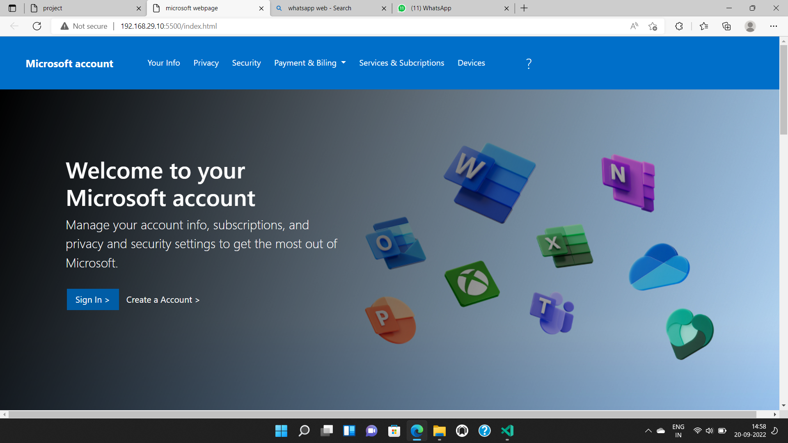
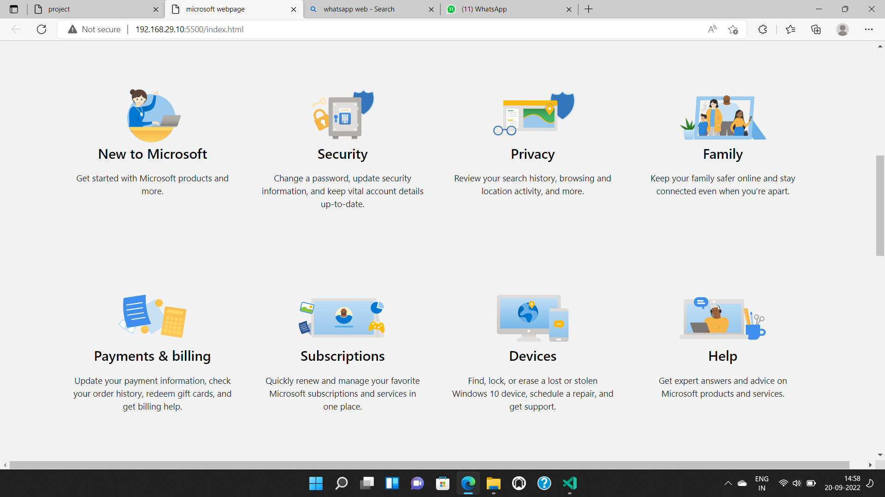
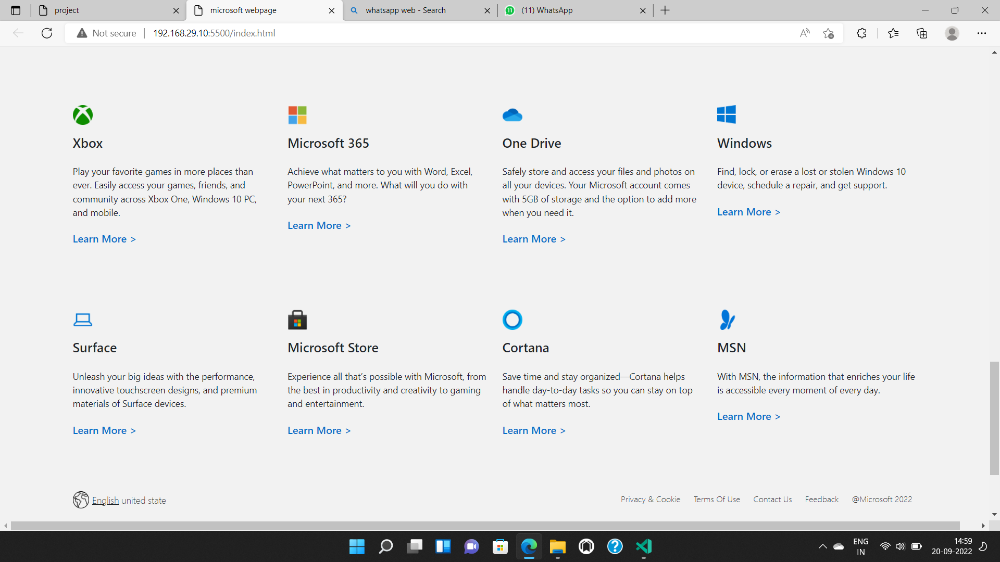

# Microsoft Login page Project

 

## Project live link
[https://my-microsoft-loginpage.netlify.app/](https://my-microsoft-loginpage.netlify.app/ "project01")

## Screenshot

 

## project Type
- UI Design
- One Page Website

## My learning from this Project
- About z-index
- How to design HTML Code
- Button Designing
- Hover effect

## Honest time to make this project
#### Approx 2-3 hour to make this project